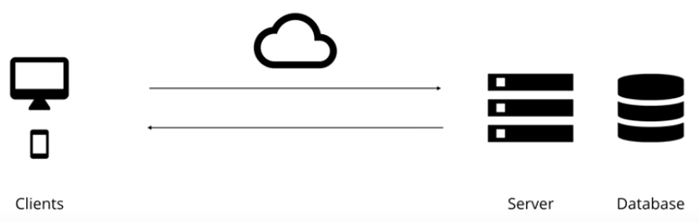

# GraphQL

> An **API** defines how a **client** can load data from a **server**.

## What is GraphQL

- new **API** standard that was invented & open-sourced by Facebook
- enables **declaratative data fetching** 启用声明式数据获取
- GraphQL Server exposes **single endpoint** and responds to **queries** GraphQL 服务器公开单个端点并响应查询

### A Query Language for APIs



## graphql 数据类型

- 基本参数类型

  - 基本类型：`String, Int, Float, Boolean, ID`
  - [类型]代表数组：`[Int]`代表整形数组

- 参数传递：参数需要定义类型
- `!` 代表参数不能为空

```schema
type Query {
  rollDice(numDice: Int!, numSides: Int): [Int]
}
```

## TypeScript, Next.js and GraphQL Series

1. setup Next.js project
2. setup Apollo
3. setup GraphQL Code Generator
4. register
5. handle and display errors
6. login
7. authenticated routes
8. forgot/change password
9. logout

benawad/type-graphql-series

```sh
npx create-next-app --example with-typescript with-typescript-app
yarn create next-app --example with-typescript with-typescript-app
```

```sh
yarn add -D @types/cookie
```
